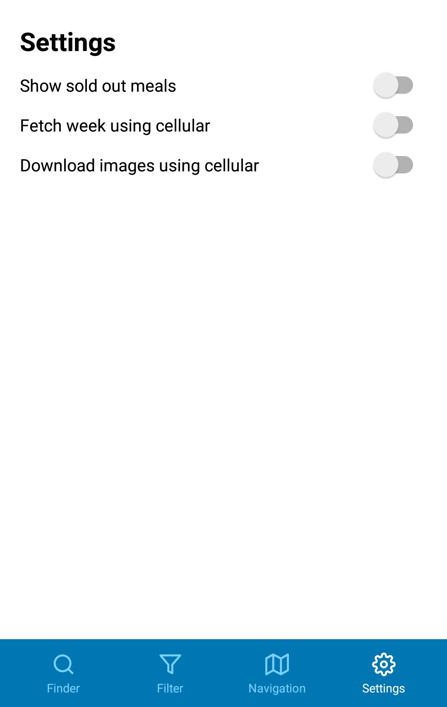

# foodi

  

Prototypical app for getting canteen recommendations based on user's location and set preferences.

## About

As part of the course work [Application Development for Mobile and Ubiquitous Computing](https://tu-dresden.de/ing/informatik/sya/professur-fuer-rechnernetze/studium/lehrveranstaltungen/lehrveranstaltungsdetails?ln=en&lv_id=48) we were to develop an app tackling typical challenges of using mobile apps. We settled on an app that supports the user in finding good meals for lunch in one of the various canteens in Dresden.  

## Usage

### Sections

#### Meal Finder

Scroll through the list of meals to find your favorite one. The meals are ordered from top to bottom by distance from your location to the respective canteen. Pick a meal to see a more detailed view and to start navigating there.

#### Meal Preferences

Set your meal preferences through various toggles and checkboxes. The app aims at the most common eating habits, such as vegetarianism or veganism 

#### Canteen Navigation

Follow the instructions based on Google Maps to find the closest canteen.

#### Settings

Configure general app settings, such as language or data use. 

## Built with

* [React](https://reactjs.org/)
* [React Native](https://facebook.github.io/react-native/)
* [Expo](https://expo.io/)

## Main Dependencies

### React Navigation

[The API documentation](https://reactnavigation.org/docs/en/api-reference.html)

The management system of all screens. This package displays the current screen and switches between screens.
It is also used to display a consistent header bar on each screen.

### Open Mensa API v2

[The API documentation](https://doc.openmensa.org/api/v2/)

This is an open source collection of data about mensa meals.

## Developing

Install [NodeJS](https://nodejs.org/) and [Expo](https://docs.expo.io/versions/latest/get-started/installation/).

Run `npm install` in the project folder to install the project dependencies.

Run `expo start` in the project folder and scan the QR-Code with your smartphone. Install the [developer app](https://expo.io/tools#client) if you haven't already.

## Authors

* **Louis Wilke** - *Prototype Development* - [SoulKa](https://github.com/SoulKa)
* **Vincent Thiele** - *Prototype Development* - [vvvt](https://github.com/vvvt)
